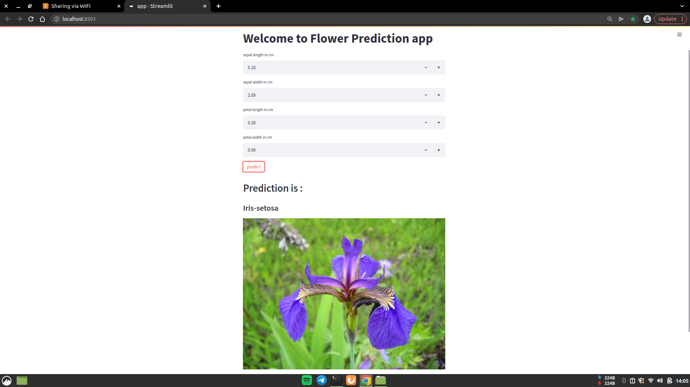

<h1>Streamlit Model Deploy</h1>
Model Deployment using streamlit

 
<h2>Quick Look</h2>

<h1>Requirements</h2>
1 - <code>pip install streamlit</code> 
2 - <code>pip install numpy</code> 
3 - <code>pip install keras</code> 

<h2>How to Run</h2>
1 - Download the Repository 
2 - Run coomand <code>streamlit run app.py</code> 
And the browser will open running this app 

